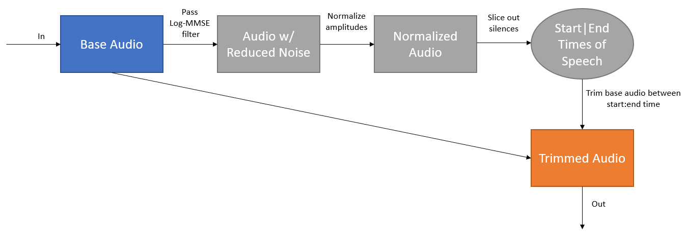

# Trim Noise (trim_noise.py)

This file takes in a wav file as input, and outputs a trimmed wav file, without silences in the beginning and end of the audio file. The pipeline is as follows:


### Trim single wav file

You can run the python file in the command line with the following structure:
```bash
python3 trim_noise.py wav <filename> --out <optional output path>
```

Here are some examples:
```bash
# No output path specified. Output file will go into the same folder as the input file, with the suffix "_out"
python3 trim_noise.py wav ./raw/cough.wav
```
```bash
# Output path specified.
python3 trim_noise.py wav ./raw/cough.wav --out ./output/cough_out.wav
```

### Trim a directory of wav files

The python file can also run on an entire directory, by parsing in "dir" instead of "wav". This time, output directory path must be specified.
```bash
python3 trim_noise.py dir <input directory path> <output directory path> --suffix <optional speficying suffix> --verbose <optional verbose value>
```

For example, the code below takes the directory **input_dir** as input, and outputs the trimmed files into **output_dir**. The trimmed files will have the suffix "_trimmed". The command line prints out the progress for every 5 files processed.
```bash
python3 trim_noise.py dir ./input_dir/ ./output_dir/ --suffix _trimmed --verbose 5
```
